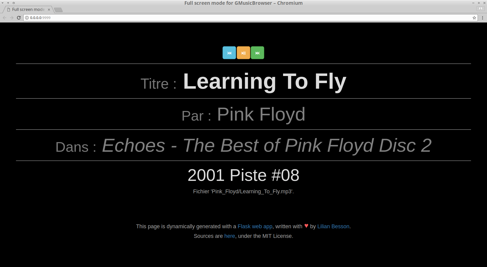
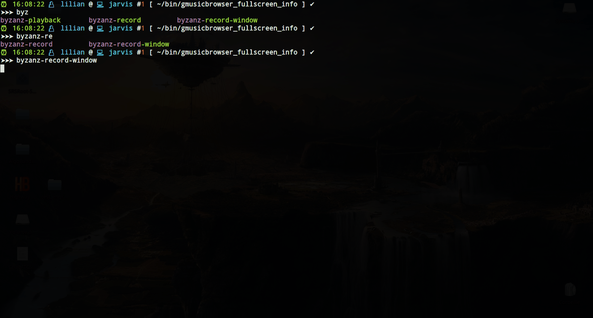
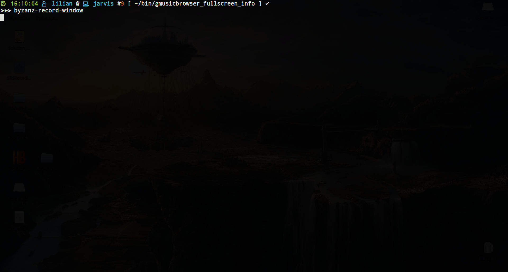

# Full Screen mode for [GMusicBrowser](http://gmusicbrowser.org/)
> Cf. [this issue](https://bitbucket.org/lbesson/bin/issues/9/) (in French).

This program is a simple web app that connects to the GMusicBrowser API to display in white-on-black and very large font the current song played by my favorite music player.
It allows to change to the next and prev song.

## Why?
When I host some friends, and use my laptop to play music, and I don't want my screen to show anything but the name of the song, and my friends should only be able to go to the next song, not read my email or whatever: putting this webpage in full screen helps!

Also, it is displayed in very large font, to be easily readable from anywhere in the room.

## Screenshot


## How to install
- Install Python, and pip,
- Install requests and Flask modules:
```bash
sudo pip3 install -U requests flask
```
- Download this folder,
- Save it somewhere, for instance `~/bin/gmusicbrowser_fullscreen_info`,
- When you want to use it, go in the folder, and do `make`.

Note: you can also use [this .desktop file](GMusicBrowser_Fullscreen_Info.desktop) to install this as a desktop application:

```bash
$ desktop-file-validate GMusicBrowser_Fullscreen_Info.desktop
# if this is OK, install it
$ sudo desktop-file-install GMusicBrowser_Fullscreen_Info.desktop
```

Then the application will be available from your desktop menu, under the name "Full screen mode for GMusicBrowser".

## Settings
In GMusicBrowser settings, under the tab "Plugins", enable the "Current song" plugin,
and use these two values for the two text boxes:

- Command to run when the song starts:
  `/home/lilian/bin/gmusicbrowser_fullscreen_info/update_ui.py start %t %a %l %y %d %n %f %c`

- Command to run when the song stops:
  `/home/lilian/bin/gmusicbrowser_fullscreen_info/update_ui.py stop %t %a %l %y %d %n %f %c`

Of course, adapt the path to where you downloaded and saved `gmusicbrowser_fullscreen_info`.

## Interactive demo
This short (15s) video shows how to do that:



## How to use
- Launching the app also opens it in Chromium (by default).
- Use 'n' to play next song, 'p' for previous song, 'space' to pause, 'u' and 'd' to increase and decrease volume (needs [this script](https://bitbucket.org/lbesson/bin/src/master/Volume.sh) somewhere in your PATH).

> This is a **very minimalist** interface to GMusicBrowser, any other manipulation still have to be done from the main GMusicBrowser interface, of course!

## Interactive demo
This other video (30s) shows how to do that:



---

## About
[](https://www.python.org/)
[](https://www.gnu.org/software/bash/)
[](https://bitbucket.org/lbesson/bin/commits/)
[](https://bitbucket.org/lbesson/ama)

### Licence ? [](https://lbesson.mit-license.org/)
Everything in this folder is publicly released under the term of the [MIT Licence](https://lbesson.mit-license.org/).

### Copyright ?
© [Lilian Besson](https://bitbucket.org/lbesson), 2018.

[](https://bitbucket.org/lbesson/bin/commits/)
[](https://bitbucket.org/lbesson/bin)

[](http://ForTheBadge.com)
[](https://bitbucket.org/lbesson)
